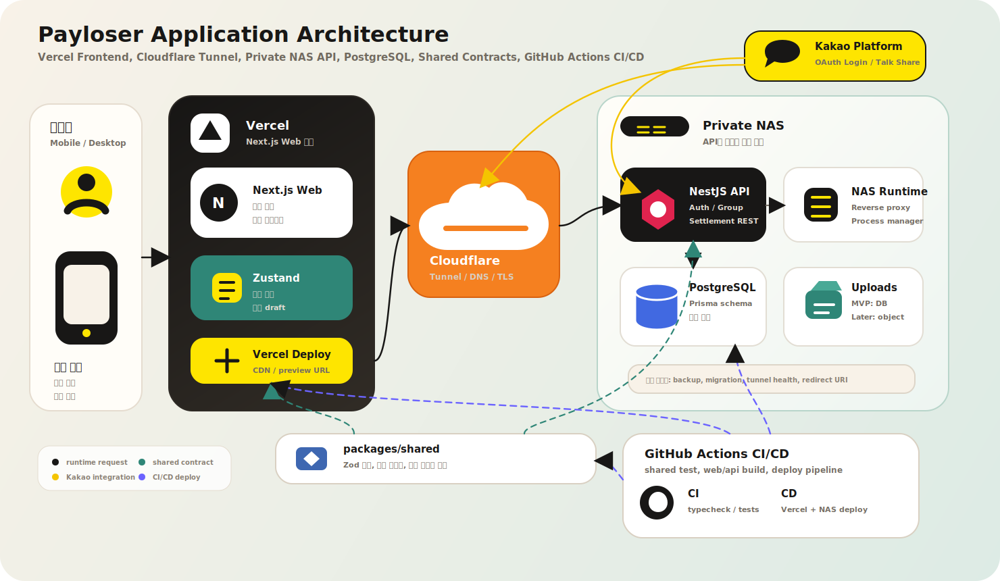

# Payloser


친구들과 볼링을 치고 나면 계산이 늘 애매했습니다.  
누구에게 몇 스택이 배정되는지, 2명 팀이 졌을 때 1등 팀 몫은 어떻게 나누는지, 신발값과 음료수 게임은 따로 봐야 하는지. Payloser는 이런 친구들만의 복잡한 내기 룰을 빠르게 계산하고, 단톡방에 바로 공유할 수 있게 만든 모바일 중심 정산 서비스입니다.

Payloser is a mobile-first settlement service built from a simple real-life pain point: bowling fees among friends can become surprisingly hard to calculate when local loser-pays rules get involved.

## 프로젝트 한 줄 소개 / One-liner

**오늘 진 사람, 계산은 깔끔하게.**  
친구들과의 볼링비 내기를 스택 단위로 계산하고, 대표 결제자가 받을 금액까지 깔끔하게 정리합니다.

**Clean settlement for messy bowling rules.**  
The service turns friend-group bowling rules into explainable stacks, payment amounts, and shareable results.

## 문제 정의 / Problem

Payloser의 출발점은 작은 불편함입니다. 볼링장에서 게임은 재미있게 끝났는데, 계산 시간이 길어지는 순간이 자주 생깁니다. 무제한 볼링은 총 결제액을 스택 단가로 바꿔야 하고, 판마다 팀이 바뀌며, 2팀/3팀/개인전/특수 룰에 따라 부담자가 달라집니다. 여기에 한 명이 일괄 결제한 경우, 그 사람이 손해 보지 않도록 송금 목록까지 만들어야 합니다.

The project starts from a lightweight but very real problem: after bowling with friends, the game is over, but the calculation is not. Unlimited bowling requires deriving a stack unit price from total payment, team composition changes every game, and local rules can redirect burdens. The payer also needs a clear recovery list.

## 핵심 기능 / Core Features 🎳

- **그룹 기반 정산**: 같이 치는 친구 그룹을 만들고, 아직 가입하지 않은 친구는 임시 멤버로 먼저 기록합니다.
- **볼링 스택 계산**: 무제한 볼링, 팀전, 개인전, 커스텀 스택, 100점 미만 독박 같은 로컬룰을 계산합니다.
- **대표 결제 복구**: 총액과 스택을 기준으로 각 멤버의 부담액과 대표 결제자가 받을 금액을 산출합니다.
- **결과 기록과 재공유**: 저장된 기록을 다시 열어 참여자, 스택 순위, 비용 순위, 평균 점수, 공유 메시지를 확인합니다.
- **카카오 중심 초대/공유**: 단톡방에 익숙한 사용 흐름에 맞춰 카카오 로그인과 공유를 중심으로 설계합니다.

## 기술 스택 / Tech Stack 🧰


| 영역     | 선택                                                                        | 이유                                                 |
| -------- | --------------------------------------------------------------------------- | ---------------------------------------------------- |
| Monorepo | pnpm workspace, Turborepo                                                   | Web/API/shared 계약과 계산 로직을 한 저장소에서 관리 |
| Web      | Next.js, TypeScript, Zustand, Tailwind CSS, Radix UI, Framer Motion, Lottie | 모바일 앱 같은 입력 흐름과 반응형 UI를 빠르게 구성   |
| API      | NestJS, TypeScript                                                          | 인증, 그룹, 정산 도메인을 모듈 단위로 분리           |
| Database | PostgreSQL, Prisma                                                          | 관계형 그룹/멤버/정산 기록 모델링에 적합             |
| Shared   | Zod, pure TypeScript calculators                                            | Web 미리보기와 API 저장 계산의 규칙 드리프트 방지    |
| Test     | Vitest, Jest, Playwright                                                    | 계산 로직, 상태 흐름, 핵심 E2E를 계층별 검증         |
| CI/CD    | GitHub Actions, Vercel, Docker, GHCR, NAS deploy                            | PR 검증과 main 배포 흐름을 분리                      |

## 아키텍처 / Architecture 🧱

### 애플리케이션 아키텍처 / Application Architecture



프론트엔드는 Vercel에 배포되는 Next.js 앱으로 운영하고, API와 데이터 계층은 Cloudflare Tunnel 뒤의 사설 NAS 서버에서 운영하는 구성을 기준으로 설계합니다. Web은 빠른 입력과 결과 미리보기를 담당하고, NAS의 NestJS API는 인증과 저장의 기준점 역할을 합니다. GitHub Actions는 `packages/shared`의 타입체크와 계산 테스트를 먼저 검증한 뒤 Web/API 빌드를 확인합니다. `main`에 merge되면 Web은 Vercel로 배포하고, API는 Docker image를 GHCR에 push한 뒤 NAS에서 pull/restart하는 흐름으로 배포합니다. 볼링 계산과 요청 계약은 `packages/shared`에 두어 브라우저 미리보기와 서버 저장 결과가 같은 규칙을 따르도록 했습니다.

The frontend is designed to run on Vercel as a Next.js app, while the API and data layer run on a private NAS server behind Cloudflare Tunnel. GitHub Actions validates `packages/shared` types and calculator tests before Web/API builds. After a merge to `main`, Web is deployed to Vercel, and the API is published as a Docker image to GHCR before the NAS pulls and restarts it. Bowling calculators and request contracts live in `packages/shared` so preview and saved results follow the same rules.

### 저장소 구조 / Repository Layout

```text
apps/
  web/        Next.js mobile-first client
  api/        NestJS REST API
packages/
  shared/     Zod contracts and pure domain calculators
  config/     Shared TypeScript/tooling configuration
docs/
  adr/        Architecture decision records
  domain/     Domain glossary and bowling rules
  portfolio/  Decision rationale and troubleshooting notes
  testing/    Testing strategy
```

### 설계 핵심 / Design Highlights

- **Shared calculator first**: 볼링 스택 계산은 `packages/shared`의 순수 함수로 구현해 Web preview와 API persistence가 같은 규칙을 사용합니다.
- **GroupMember identity model**: 앱 전체 친구 목록보다 그룹 안의 멤버를 중심으로 모델링합니다. 임시 멤버는 나중에 카카오 계정과 연결됩니다.
- **Owner-approved join request**: 초대 링크를 탄 사용자가 임시 멤버를 직접 선택하지 않고, 그룹 대표가 승인하며 연결합니다.
- **Public read-only result link**: 단톡방 공유 흐름을 위해 결과는 읽기 전용 토큰 링크로 확인하고, 수정/관리 권한은 로그인 뒤 처리합니다.
- **문서화 기준 / Documentation harness**: 기술 선택, 트레이드오프, 최적화/보안 후속 과제를 한국어 우선 문서로 누적합니다.

## 볼링 계산 모델 / Bowling Calculation Model 🧾

Payloser의 핵심 도메인은 스택입니다.

1. 무제한 볼링 총액을 총 스택으로 나눠 스택 단가를 계산합니다.
2. 각 판의 팀 구성, 점수, 순위, 로컬룰을 바탕으로 멤버별 스택을 배정합니다.
3. 스택 단가와 멤버별 스택을 곱해 부담액을 계산합니다.
4. 반올림 후 총액이 대표 결제 금액과 일치하도록 보정합니다.
5. 대표 결제자가 실제로 받을 송금 목록을 생성합니다.

The stack model keeps the local rule explainable: first allocate stacks, then convert stacks to money, then adjust rounding so the payer recovers the exact paid amount.

## 기술적으로 다룬 문제 / Technical Problems 🔧

볼링비 계산 자체는 작아 보이지만, 실제 서비스로 만들면 계산 정확도, 인증 리다이렉트, 공유 링크, 파일 업로드, 모노레포 패키지 경계 같은 문제가 함께 따라옵니다. README에는 기능 설명보다 구현하면서 특히 깨지기 쉬운 기술 지점을 중심으로 정리했습니다.

| 기술 문제                                                                    | 접근 방식                                                                                                                        | 확인 기준                                           |
| ---------------------------------------------------------------------------- | -------------------------------------------------------------------------------------------------------------------------------- | --------------------------------------------------- |
| Web 미리보기와 API 저장 계산이 서로 다른 규칙을 사용할 수 있음               | 볼링 스택 배정과 반올림 계산을 `packages/shared` 순수 함수로 분리                                                                | 같은 calculator 테스트를 Web/API가 공유             |
| 금액 반올림 후 합계가 대표 결제 금액과 달라질 수 있음                        | 스택 단가 계산, 10원 단위 반올림, 총액 보정을 계산 계층에서 처리                                                                 | 부담액 합계가 항상 결제 총액과 일치                 |
| Prisma `Decimal`과 JavaScript `number`가 섞이며 응답 값이 흔들릴 수 있음     | API 공통 변환 유틸로 Decimal-like 값을 명시적으로 number로 변환                                                                  | 정산 조회/요약 응답에서 숫자 타입 일관성 유지       |
| shared package를 Web 번들러와 NestJS `NodeNext` 환경이 다르게 해석할 수 있음 | ESM 패키지 export 경로와 dist 빌드 결과를 NodeNext 기준으로 맞춤                                                                 | API/Web 타입체크 모두 통과                          |
| OAuth callback에서 state/cookie/redirect 설정이 어긋날 수 있음               | Kakao OAuth state cookie, returnTo cookie, local redirect URI를 API 기준으로 관리                                                | 실패 시 `authError`로 복귀하고 세션 오염 방지       |
| 쿠키 세션과 업로드가 배포 설정 누락이나 브라우저 CSRF에 취약해질 수 있음     | 프로덕션 세션 secret 누락 시 서버 시작 실패, DB 세션 폐기, Origin/Referer 검증, rate limit, 업로드 파일 검증을 API 진입점에 추가 | 설정 누락 시 실패하고, 비신뢰 Origin/위장 파일 차단 |
| 로그인 확인 전 보호된 화면이 잠깐 보일 수 있음                               | 세션 bootstrap 완료 전에는 앱 화면 대신 로딩 shell을 렌더링                                                                      | 비로그인 사용자가 그룹 화면을 순간적으로 보지 않음  |
| 공개 결과 링크가 편해야 하지만 과한 데이터 노출은 위험함                     | read-only token link와 로그인 필요 액션을 분리하고, revocation/noindex는 배포 전 체크리스트로 관리                               | 공개 링크에는 수정/관리 권한이 없음                 |
| NAS API를 외부에 직접 노출하면 HTTPS와 네트워크 경계가 애매해질 수 있음      | Cloudflare Tunnel을 API 진입점으로 두고, NAS의 API/DB는 사설망 뒤에서 운영                                                       | public inbound port 의존도 감소, tunnel health 확인 |
| DB 기반 이미지 업로드는 MVP에는 빠르지만 배포 후 비용/성능 리스크가 있음     | MVP에서는 DB 저장을 허용하되, 파일 제한과 object storage 전환 계획을 운영 문서에 남김                                            | 배포 전 저장소 전환 여부를 명시적으로 결정          |
| 그룹/정산 상태가 한 컴포넌트에 몰리면 UI 변경 때 회귀가 커짐                 | workspace controller, group workflow hook, local session helper 등으로 상태 책임을 분리                                          | 주요 상태 테스트와 타입체크로 회귀 확인             |

더 자세한 트러블슈팅 기록 형식은 [docs/portfolio/troubleshooting-harness.md](./docs/portfolio/troubleshooting-harness.md)에 누적합니다.

## 보안 하드닝 / Security Hardening 🔐

MVP라도 돈 계산과 단톡방 공유가 들어가면 보안 기준을 느슨하게 둘 수 없습니다. Payloser는 설정이 빠졌을 때 조용히 넘어가지 않고, 공개 링크는 읽기 전용으로 제한하며, 세션/초대/업로드 판단은 API에서 끝내는 방향으로 정리했습니다.

| 영역           | 적용 내용                                                                                   | 확인 기준                                                        |
| -------------- | ------------------------------------------------------------------------------------------- | ---------------------------------------------------------------- |
| 세션           | 프로덕션에서 `SESSION_COOKIE_SECRET`이 없으면 서버 시작 실패, DB 세션 저장, 로그아웃 폐기   | secret 누락 시 서버가 뜨지 않고, 로그아웃 후 세션이 무효화       |
| 요청 진입점    | Origin/Referer 검증, 경로별 rate limit, 정산 payload 배열 상한                              | 낯선 출처, 비정상 반복 요청, 과도한 입력을 API에서 차단          |
| 초대 링크      | 충분히 긴 난수 토큰, 기본 만료 시간, 대표 권한의 폐기/재발급                                | 만료되거나 폐기된 초대 링크로는 가입 요청을 만들 수 없음         |
| 공개 결과 링크 | 공유 토큰 만료/폐기/재발급, 읽기 전용 응답 모델, `X-Robots-Tag: noindex, nofollow`          | 공개 응답에 관리용 내부 ID를 싣지 않고, 검색 엔진 색인을 막음    |
| 이미지 업로드  | 3MB 제한, magic-byte MIME 검증, 이미지 dimension 제한, `PUBLIC_API_ORIGIN` 필수 설정        | 위장 파일, 과대 이미지, host header 기반 URL 오염을 차단         |
| 배포 설정      | Prisma migration, Prisma client generation, `WEB_ORIGIN`/API origin/세션 secret 릴리스 점검 | 로컬에서만 통과하던 설정 누락이 운영 배포로 넘어가지 않도록 확인 |

## CI/CD 🚀

Payloser의 배포는 PR 검증과 운영 배포를 분리합니다. PR에서는 shared, Web, API가 각각 테스트/빌드되고, `main`에 merge되어 push가 발생하면 Web과 API 배포가 이어집니다.

| 흐름      | 트리거              | 하는 일                                                     |
| --------- | ------------------- | ----------------------------------------------------------- |
| Shared CI | push, pull_request  | 공통 Zod 계약과 계산 로직 타입체크/테스트/빌드              |
| Web CI    | push, pull_request  | Next.js 테스트와 production build 검증                      |
| API CI    | push, pull_request  | API 테스트/빌드와 Docker image build check                  |
| Web CD    | `main` push, manual | Vercel production 배포                                      |
| API CD    | `main` push, manual | GHCR image push, NAS SSH 접속, migration, container restart |

API는 NAS에서 직접 빌드하지 않습니다. GitHub Actions가 image를 만들고 GHCR에 올리면, NAS는 image를 pull한 뒤 `prisma migrate deploy`와 `docker compose up -d --no-deps api`만 수행합니다. 필요한 secret이 아직 설정되지 않은 경우 deploy job은 배포를 건너뛰도록 구성했습니다.

자세한 설정 값과 NAS 준비 절차는 [GitHub Actions CI/CD 문서](./docs/operations/github-actions-cicd.md)에 정리했습니다.

## 테스트 전략 / Testing Strategy 🧪

- `packages/shared`: 볼링 계산, 팀 점수 보정, 커스텀 스택, 반올림, 대표 결제 복구를 Vitest로 검증합니다.
- `apps/api`: 인증, 그룹, 초대, 정산 저장/조회 흐름을 NestJS/Jest 기반으로 검증합니다.
- `apps/web`: Zustand 상태 흐름, 볼링 draft model, 주요 UI 흐름을 Vitest와 Playwright로 검증합니다.

```bash
pnpm test
pnpm test:shared
pnpm test:api
pnpm test:web
pnpm e2e
```

## 로컬 실행 / Local Development

```bash
pnpm install
docker compose -f infra/docker/compose.yaml up -d
pnpm dev
```

주요 포트:

- Web: `http://localhost:3002` 또는 실행 시 지정한 Next.js 포트
- API: `http://localhost:3001`
- Kakao OAuth local redirect: `http://localhost:3001/auth/kakao/callback`

## 문서 / Documentation

- [프로젝트 맥락 / Context](./CONTEXT.md): 제품과 도메인 맥락
- [볼링 계산 규칙 / Bowling Rules](./docs/domain/bowling-rules.md): 볼링 계산 규칙
- [판단 근거 / Decision Rationale](./docs/portfolio/decision-rationale.md): 기술/제품 판단 근거
- [트러블슈팅 하네스 / Troubleshooting Harness](./docs/portfolio/troubleshooting-harness.md): 문제 해결 기록 형식
- [최적화/보안 백로그 / Optimization & Security Backlog](./docs/portfolio/optimization-and-security-backlog.md): 배포 전 최적화/보안 체크리스트
- [GitHub Actions CI/CD](./docs/operations/github-actions-cicd.md): Vercel, GHCR, NAS 배포 흐름
- [테스트 전략 / Testing Strategy](./docs/testing/strategy.md): 테스트 계층과 우선순위

## 현재 MVP 범위 / MVP Scope

현재 MVP는 볼링 정산 완성도에 집중합니다. 스크린야구, 스크린골프, RPS 기록은 확장 가능한 활동 도메인으로 남기되, 지금 단계에서 가장 잘 보여줄 수 있는 부분은 복잡한 볼링 정산과 그룹 기반 사용자 관리입니다.

The current MVP focuses on bowling settlement quality. Other activities can be added later, while the strongest technical story remains complex settlement logic plus group-based identity management.
